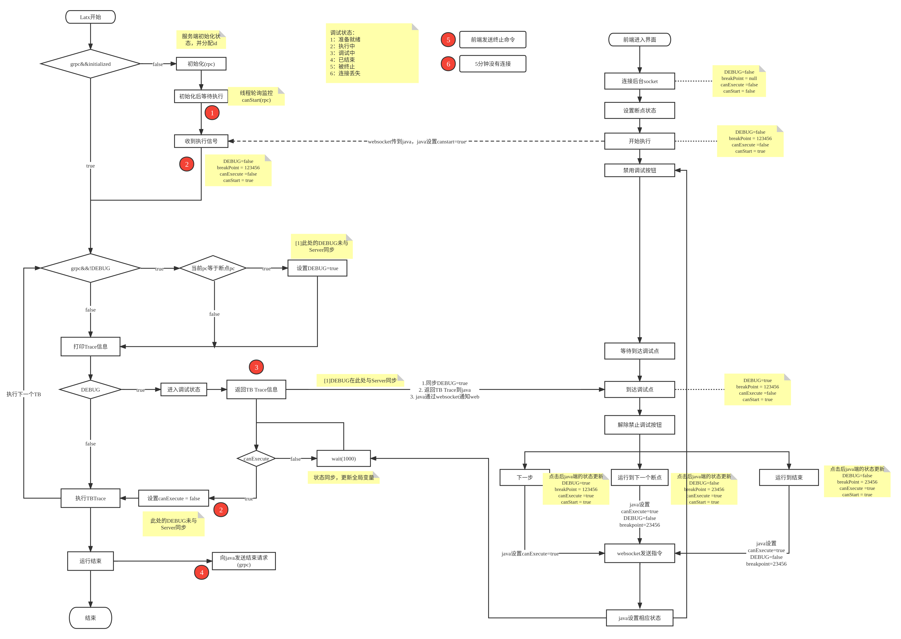

<h1 align="center">loongson-visual-debug-backend</h1>

<em>
本项目是龙芯可视化调试系统的后端工程
</em>

### 目录
- [相关技术](#相关技术)
- [快速开始](#快速开始)
- [Docker运行与部署🐳](#docker运行与部署)
- [项目文档](#项目文档)


## 相关技术

- Database
    - Mysql 8.0
- Springboot
    - Mybatis-plus
    - Grpc.io
- Remote Process Call (RPC)
    - grpc-c++
    - grpc-java
- websocket

## 快速开始
```shell
./mvnw clean compile spring-boot:run
```
执行命令后访问 `http://localhost:8000/hello` 确认服务正常运行. 🙏

请及时更改前端项目中的`basic_url`，并将它指向后端服务的地址`http://localhost:8000`


## Docker运行与部署🐳
<em>通过这种方式构建一个docker镜像与容器，可以方便的移植和部署在其他机器上</em>
1. 构建docker镜像

```shell
cd loongson-visual-debug-backend
docker build -t loongson-visual-debug-backend .
```

2. 运行
```shell
#后台运行
docker run -d \
    -p 8000:8000 \
    -p 50071:50071 \
    --name visual-debug-backend \
    loongson-visual-debug-backend
    
#前台运行
docker run -it \
    -p 8000:8000 \
    -p 50071:50071 \
    --name visual-debug-backend \
    loongson-visual-debug-backend
```
> 端口说明:`8080`端口为web提供HTTP接口服务，`50071`端口作为`grpc server` 为 `latx` 提供在线调试接口

运行时请自定义你可以使用的端口以映射到容器中的`8000`端口和`50071`端口

3. 访问 `http://localhost:8000/hello` 确认服务正常运行. 🙏
   
- 如果已经部署在服务器上，使用其他电脑访问`http://ip:自定义端口`


- 请及时更改前端项目中的`basic_url`，并将它指向后端服务的地址`http://ip:自定义端口`

## 项目文档

### 在线调试流程图



[查看高清图](https://www.processon.com/view/link/6265f90b63768950bc5801ed)

(更新中...)

### 数据库错误修改

如果数据库报错提示